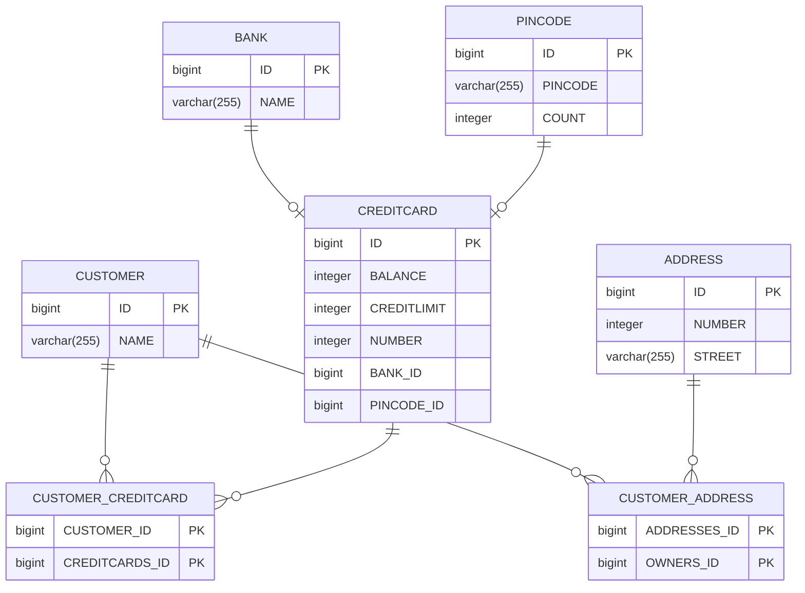
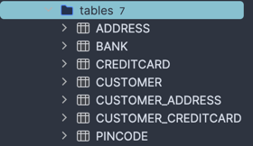

# DAT250 ASSIGNMENT REPORT 4
The goal of this assignment was to use Java Persistence Architecture and object-relation mapping. Template was taken from the
task description. 

## Experiment 2 Banking/Credit Card example JPA
All the code i wrote is in the module [Credit Cards Module](./src/main/java/no/hvl/dat250/jpa/tutorial/creditcards/)
This module contains the main entity classes and their relationships for the credit card example, including `Customer`, `Address`, `Bank`, `CreditCard`, and `Pincode`. Each class represents a table in the database, and their relationships are defined using JPA annotations.

### Explain the used database and how/when it runs

  In this application, i used `H2 database` in embedded mode. This means the database runs within the same Java process as the application, and the data is stored in a local file (`DB.mv.db`) rather than on a separate server. This setup is convenient for development and testing purposes, as it allows us to create, manipulate, and inspect the database directly from our code.

    
### Can you provide the SQL used to create the table Customer?
  
```
  CREATE TABLE CUSTOMER(ID BIGINT auto_increment primary key, NAME CHARACTER VARYING(255));
```
  

### Find a way to inspect the database tables being created and create a database schema in your report. Do the created tables correspond to your initial thoughts regarding the exercise?

I used the IntelliJ database plugin to inspect the tables. To do this, I connected to the H2 database using the `DB.mv.db` file as a data source in IntelliJ. This allowed me to view the structure and data of each table directly in the IDE. The generated tables matched my initial expectations based on the entity classes and their relationships.


.

## Conclusion
I've managed to implement solution that passed given tests. I don't know about any pending issues.
